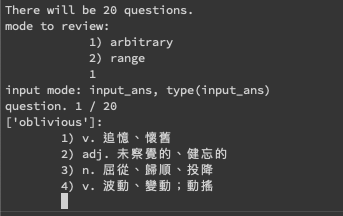
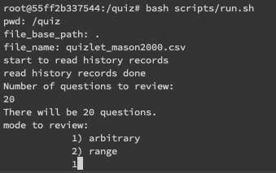
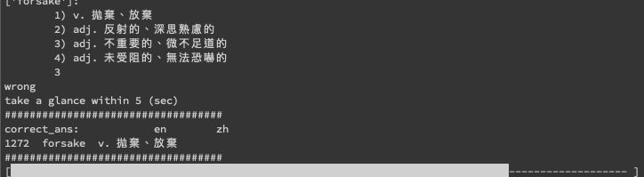
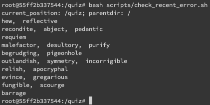

# user guide

- download docker desktop
 
- [docker build](#docker-build)

- [docker run](#docker-run) (with volume, to one of your directory) to get inside the docker container

  - [take a quiz](#take-a-quiz)



    - to determine how many question you are going to answer

    - to determine the mode: (1) random (2) in a specific range



    - if you are wrong, review it for 5 sec(s) in default



  - [check errors](#check-errors) (optional)

    


Hopefully this tool may help you. Enjoy it!

--

# sample command to run (on your local computer):


## docker build

- first, download docker and build your docker image

```
bash scripts/build_docker_img.sh
```


## docker run

- command template:

```
docker run \
-v [DIR_ON_YOUR_LOCAL_MACHINE]:[DIR_IN_DOCKER] \
-it [YOUR_DOCKER_IMAGE_NAME] \
/bin/bash
```

e.g.
```
docker run \
-v /Users/johnson.huang/py_ds/tutor_python_project/bookmarks/GRE_prepare/GRE_vocab/MasonGRE_2000/quiz:/quiz \
-it quizlet/version \
/bin/bash
```


## take a quiz

- after you enter the docker container, take a quiz

```
bash scripts/run.sh
```

```
# pattern of docker volumn:     [real world dir] : [inside docker dir]

docker run -v REAL_WORLD_DIR:INSIDE_DOCKERDIR -it YOUR_DOCKER_IMAGE_NAME /bin/bash

#docker run -v /Users/johnson.huang/py_ds/tutor_python_project/bookmarks/GRE_prepare/GRE_vocab/MasonGRE_2000/quiz:/quiz -it quizlet/version /bin/bash


#docker run \
#-v /Users/johnson.huang/py_ds/tutor_python_project/bookmarks/GRE_prepare/GRE_vocab/MasonGRE_2000/quiz:/dokodemo_door \
#quizlet/version:latest \
#bash scripts/run.sh
```


## check errors

- check recent error records

```
bash scripts/check_recent_error.sh
```
